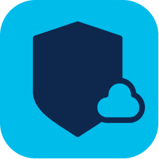

# Kosha Cisco Panoptica Connector

Cisco Panoptica provides a comprehensive security solution for your entire software development lifecycle (SDLC), from development to runtime. Panoptica provides visibility and remediation for containerized applications managed by Kubernetes, serverless functions, and all your APIs.

The Cisco Panoptica connector enables you to perform REST API operations from the Panoptica API in your Kosha workflow or custom application. Using the Cisco Panoptica connector, you can directly access the Panoptica platform to:

* Create environments and clusters
* Create policies
* Add images and registries

## Useful Actions

You can use the Kosha Cisco Panoptica connector to retrieve and manage:

* Logins and passwords
* Dashboard statistics
* Environment definitions
* Telemetry information
* Environment and connection policies
* API security policies
* CI/CD policies
* Registries
* Kubernetes clusters
* Image Hashes
* Audit Logs
* Serverless policies
* System settings

Refer to the Panoptica connector [API specification](openapi.json) for details.

## Example Usage

See the [Panoptica REST API documentation](https://panoptica.readme.io/docs/rest-api#intro) for details on prerequisites and usage.

## Authentication

The REST API uses Escher authentication. This method uses a unique token for each request. The token is a hash generated from fixed Access and Secret keys (obtained from Panoptica), the request URL, and the request time.

Refer to the [authentication documentation](https://panoptica.readme.io/docs/rest-api#authentication) for instructions on generating unique Access and Secret keysfrom the Panoptica console. 